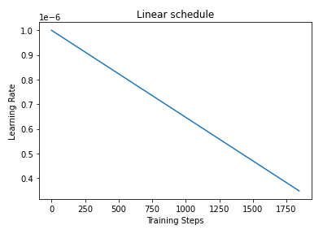
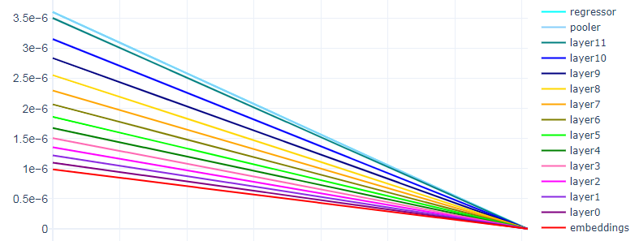
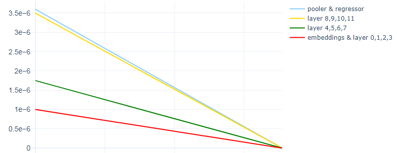
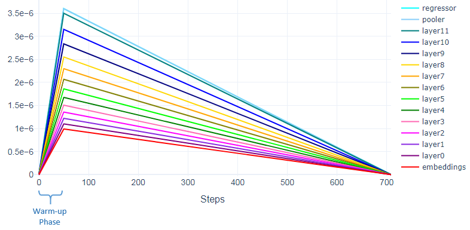
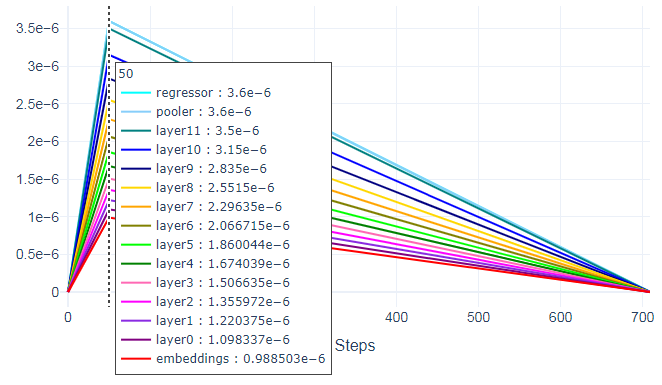
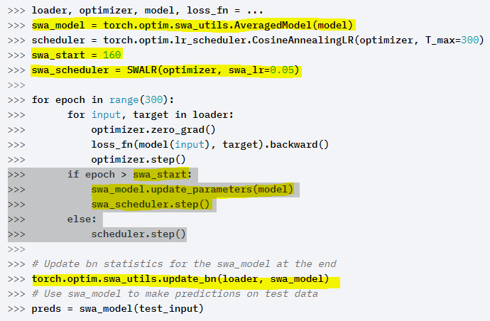
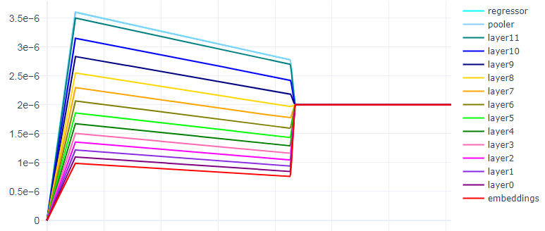
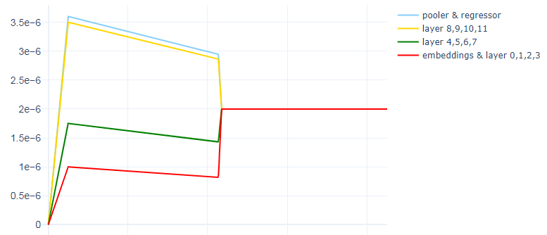
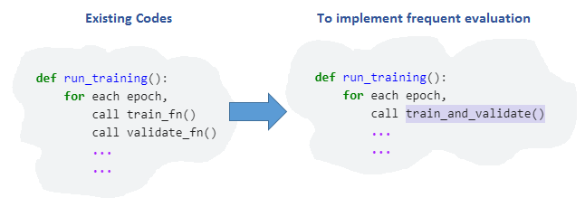
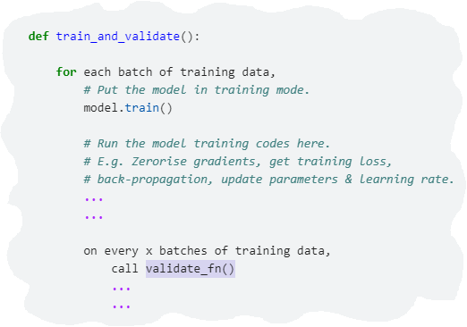

随着Transformer一炮而红，越来越多的研究者尝试将Transformer应用在不同的领域。那么，你的Transformer模型具体表现如何？它是否能够取得相当好的结果？ 或者你的 Transformer 模型是否受到性能和不稳定的影响？ 如果是，则根本原因通常很难诊断和确定，特别的，此类问题通常发生在大型模型和小型数据集上。当然，相关数据和下游任务的性质和特征也发挥着影响。

让我们假设一种场景，如果你的 Transformer 没有达到你的预期效果，你能做什么？是否可以尝试超参数调整，包括：学习率的变化、批大小（batchsize）的更改等等。那么，本文也提供了一些微调Transformer的高级技法，这些技术可用于微调不同的Transformer模型，例如 BERT、ALBERT、RoBERTa等。

# 1.目录

- 逐层学习率衰减
- 预热步骤
- 重新初始化预训练层
- 统计权重平均
- 基于频率的验证

# 2.逐层学习率衰减

在《重新审视少样本 BERT 微调》(Revisiting Few-sample BERT Fine-tuning)这篇论文中，作者将**逐层学习率衰减**描述为“一种对顶层应用较高学习率而对底层应用较低学习率的方法。这是通过设置顶层的学习率并使用乘法衰减率从上到下逐层降低学习率来实现的。”

《用于文本分类的通用语言模型微调》(Universal Language Model Fine-tuning for Text Classification)中也表达了一个类似的概念，称为**判别性微调**。

​	 *判别式微调允许我们用不同的学习率调整每一层，而不是对模型的所有层使用相同的学习率*

这样的设置是有意义的，因为 Transformer 模型中的不同层通常捕获不同类型的信息。底层通常编码更常见、通用和基础广泛的信息，而靠近输出的顶层编码则更近似于本地化和特定于手头任务的信息。

这里，给出一个``roberta-base``模型，由一个嵌入层和12个隐藏层组成，我们使用了一个线性调度器，并在优化器中设置了``1e-6``(即 0.000001)的初始学习率。如下图所示，调度程序创建了一个学习率在整个训练步骤中从``1e-6``线性下降到零的计划。



现在，要实现逐层学习率衰减(或判别式微调)，有两种可能的方法。

第一种方法是遵循《重新审视少样本 BERT 微调》(Revisiting Few sample BERT Fine-tuning)中描述的方法。我们为顶层选择``3.5e-6``的学习率，并使用``0.9``的乘法衰减率从上到下逐层降低学习率。 这将导致底层(``embedding``和``layer0``)的学习率大致接近``1e-6``。我们在名为**``roberta_base_AdamW_LLRD``**的函数中执行此操作。

好的，我们已经为隐藏层设置了学习率，那么``pooler``和``regressor``头怎么样呢？ 对于这些，我们选择``3.6e-6``，一个比顶层略高的学习率。

在下面的代码中，``head_params``、``layer_params``和``embed_params``是定义我们要优化的参数、学习率和权重衰减的字典。 所有这些参数组都传递给``AdamW``优化器，由函数返回。

````python
def roberta_base_AdamW_LLRD(model):
    
    opt_parameters = []    # To be passed to the optimizer (only parameters of the layers you want to update).
    named_parameters = list(model.named_parameters()) 
        
    # According to AAAMLP book by A. Thakur, we generally do not use any decay 
    # for bias and LayerNorm.weight layers.
    no_decay = ["bias", "LayerNorm.bias", "LayerNorm.weight"]
    init_lr = 3.5e-6 
    head_lr = 3.6e-6
    lr = init_lr
    
    # === Pooler and regressor ======================================================  
    
    params_0 = [p for n,p in named_parameters if ("pooler" in n or "regressor" in n) 
                and any(nd in n for nd in no_decay)]
    params_1 = [p for n,p in named_parameters if ("pooler" in n or "regressor" in n)
                and not any(nd in n for nd in no_decay)]
    
    head_params = {"params": params_0, "lr": head_lr, "weight_decay": 0.0}    
    opt_parameters.append(head_params)
        
    head_params = {"params": params_1, "lr": head_lr, "weight_decay": 0.01}    
    opt_parameters.append(head_params)
                
    # === 12 Hidden layers ==========================================================
    
    for layer in range(11,-1,-1):        
        params_0 = [p for n,p in named_parameters if f"encoder.layer.{layer}." in n 
                    and any(nd in n for nd in no_decay)]
        params_1 = [p for n,p in named_parameters if f"encoder.layer.{layer}." in n 
                    and not any(nd in n for nd in no_decay)]
        
        layer_params = {"params": params_0, "lr": lr, "weight_decay": 0.0}
        opt_parameters.append(layer_params)   
                            
        layer_params = {"params": params_1, "lr": lr, "weight_decay": 0.01}
        opt_parameters.append(layer_params)       
        
        lr *= 0.9     
        
    # === Embeddings layer ==========================================================
    
    params_0 = [p for n,p in named_parameters if "embeddings" in n 
                and any(nd in n for nd in no_decay)]
    params_1 = [p for n,p in named_parameters if "embeddings" in n
                and not any(nd in n for nd in no_decay)]
    
    embed_params = {"params": params_0, "lr": lr, "weight_decay": 0.0} 
    opt_parameters.append(embed_params)
        
    embed_params = {"params": params_1, "lr": lr, "weight_decay": 0.01} 
    opt_parameters.append(embed_params)        
    
    return transformers.AdamW(opt_parameters, lr=init_lr)
````

下面是具有逐层学习率衰减的线性设计的示意图：



实现逐层学习率衰减(或判别式微调)的第二种方法是将层分组到不同的集合中，并对每个层应用不同的学习率。 我们将其称为**grouped LLRD**。

使用新函数**``roberta_base_AdamW_grouped_LLRD``**，我们将**``roberta-base``**模型的 12 个隐藏层分成 3 组，嵌入附加到第一组，具体如下：

1. Embedding+Layer 0，1，2，3(学习率：``1e-6``)
2. Layer 4, 5, 6, 7(学习率：``1.75e-6``)
3. Layer 8, 9, 10, 11(学习率：``3.5e-6``)

与第一种方法相同，我们使用``3.6e-6``作为``pooler``和``regressor``头，学习率略高于顶层。

````python
def roberta_base_AdamW_grouped_LLRD(model):
        
    opt_parameters = []       # To be passed to the optimizer (only parameters of the layers you want to update).
    named_parameters = list(model.named_parameters()) 
    
    # According to AAAMLP book by A. Thakur, we generally do not use any decay 
    # for bias and LayerNorm.weight layers.
    no_decay = ["bias", "LayerNorm.bias", "LayerNorm.weight"]
    set_2 = ["layer.4", "layer.5", "layer.6", "layer.7"]
    set_3 = ["layer.8", "layer.9", "layer.10", "layer.11"]
    init_lr = 1e-6
    
    for i, (name, params) in enumerate(named_parameters):  
        
        weight_decay = 0.0 if any(p in name for p in no_decay) else 0.01
 
        if name.startswith("roberta_model.embeddings") or name.startswith("roberta_model.encoder"):            
            # For first set, set lr to 1e-6 (i.e. 0.000001)
            lr = init_lr       
            
            # For set_2, increase lr to 0.00000175
            lr = init_lr * 1.75 if any(p in name for p in set_2) else lr
            
            # For set_3, increase lr to 0.0000035 
            lr = init_lr * 3.5 if any(p in name for p in set_3) else lr
            
            opt_parameters.append({"params": params,
                                   "weight_decay": weight_decay,
                                   "lr": lr})  
            
        # For regressor and pooler, set lr to 0.0000036 (slightly higher than the top layer).                
        if name.startswith("regressor") or name.startswith("roberta_model.pooler"):               
            lr = init_lr * 3.6 
            
            opt_parameters.append({"params": params,
                                   "weight_decay": weight_decay,
                                   "lr": lr})    
    
    return transformers.AdamW(opt_parameters, lr=init_lr)
````

以下是具有**grouped LLRD**的线性设计的示意图：



# 3.预热步骤

对于我们使用的线性调度程序，我们可以应用预热步骤。 例如，应用 50 个预热步骤意味着学习率从0线性增加到优化器中设置的初始学习率，需要经历50个步骤（预热阶段）。 之后，学习率将开始线性下降到 0。



下图显示了各个层在第 50 步的学习率，这些是我们为优化器设置的学习率。



要应用预热步骤，请在``get_scheduler``函数上输入参数`` num_warmup_steps``。

````python
scheduler = transformers.get_scheduler(
                "linear",    
                optimizer = optimizer,
                num_warmup_steps = 50,
                num_training_steps = train_steps
)
````

或者，你也可以使用``get_linear_schedule_with_warmup``。

````python
scheduler = transformers.get_linear_schedule_with_warmup(                
                optimizer = optimizer,
                num_warmup_steps = 50,
                num_training_steps = train_steps
)
````

# 4.重新初始化预训练层

微调 Transformer 轻而易举，因为我们使用的是预先训练好的模型。这意味着我们不是从头开始训练，但是这可能会占用大量运算资源和时间。这些模型通常已经在大量文本数据上进行了预训练，并且它们包含我们可以使用的预训练权重。 但是，为了获得更好的微调结果，有时我们需要在微调过程中丢弃其中一些权重并重新初始化它们。

那么我们如何做到这一点呢？早些时候，我们讨论了 Transformer 的不同层捕获不同类型的信息，底层通常编码更为一般性的信息。这些很有用，因此我们希望保留这些低级表示，所以我们要刷新的是靠近输出的顶层参数设置。它们是对预训练任务更具体的信息进行编码的层。

我们可以在之前创建的 MyModel 类中执行此操作。初始化模型时，我们传入一个参数，指定要重新初始化的前 n 层。你可能会问，为什么是n？事实证明，选择n作为最佳值至关重要，可以加快收敛速度。也就是说，有多少顶层要重新初始化？ 嗯，这取决于，每个模型和数据集都是不同的。对于我们的情况，n 的最佳值为 5。如果重新初始化超出最佳点的更多层，你可能会会获得相反的效果。

在下面的代码中，我们使用均值 0 和由模型的``initializer_range``定义的标准差重新初始化``nn.Linear``模块的权重，并使用值 1 重新初始化``nn.LayerNorm``模块的权重，偏差重新初始化为 0 的值。

如代码所示，我们也在重新初始化``pooler``层。 如果你没有在你的模型中使用池化器，你可以在``_do_reinit``中省略与它相关的部分。

````python
class MyModel(nn.Module):
            
    def __init__(self, reinit_n_layers=0):        
        super().__init__() 
        self.roberta_model = RobertaModel.from_pretrained('roberta-base')       
        self.regressor = nn.Linear(768, 1)  
        self.reinit_n_layers = reinit_n_layers
        if reinit_n_layers > 0: self._do_reinit()            
            
    def _do_reinit(self):
        # Re-init pooler.
        self.roberta_model.pooler.dense.weight.data.normal_(mean=0.0, std=self.roberta_model.config.initializer_range)
        self.roberta_model.pooler.dense.bias.data.zero_()
        for param in self.roberta_model.pooler.parameters():
            param.requires_grad = True
        
        # Re-init last n layers.
        for n in range(self.reinit_n_layers):
            self.roberta_model.encoder.layer[-(n+1)].apply(self._init_weight_and_bias)
            
    def _init_weight_and_bias(self, module):                        
        if isinstance(module, nn.Linear):
            module.weight.data.normal_(mean=0.0, std=self.roberta_model.config.initializer_range)
            if module.bias is not None:
                module.bias.data.zero_()
        elif isinstance(module, nn.LayerNorm):
            module.bias.data.zero_()
            module.weight.data.fill_(1.0)        
 
    def forward(self, input_ids, attention_mask):        
        raw_output = self.roberta_model(input_ids, attention_mask, return_dict=True)        
        pooler = raw_output["pooler_output"]    # Shape is [batch_size, 768]
        output = self.regressor(pooler)         # Shape is [batch_size, 1]
        return output 
````

# 5.统计权重平均

**随机权重平均(SWA)**是一种深度神经网络训练技术，在《Averaging Weights Leads to Wider Optima and Better Generalization》中提出。 根据作者的说法：

​	 *与传统的训练方案相比，SWA 非常容易实现并且几乎没有计算开销*

那么，SWA 是如何工作的呢？ 正如 PyTorch 博客(https://pytorch.org/blog/pytorch-1.6-now-includes-stochastic-weight-averaging/)中所述，SWA 包含两种成分：

- 首先，它使用**可修改的学习率计划**。 例如，我们可以在训练时间的前 75% 使用标准的衰减学习率策略（例如上文我们使用的线性方法），然后将学习率设置为一个合理高的恒定值，用于剩余 25% 的训练时间。
- 其次，它对遍历的网络的权重**取相等的平均值**。 例如，我们可以在最后 25% 的训练时间内，保持最后获得的权重的平均运行值。训练完成后，我们将网络的权重设置为计算的 SWA 平均值。

## 那么如何在PyTorch中使用SWA呢？

在``torch.optim.swa_utils``中，我们实现了所有 SWA 成分，以便在任何模型中使用 SWA。

特别是，我们为 SWA 模型实现了``AveragedModel``类、``SWALR``学习率调度程序和 ``update_bn``实用函数，以在训练结束时更新 SWA 批量归一化统计数据。

SWA 在 PyTorch 中很容易实现，你可以参考 PyTorch 文档中提供的示例代码来实现 SWA，例如：



为了在我们的``run_training``函数中实现 SWA，我们为``swa_lr``引入一个参数，此参数是设置为恒定值的 SWA 学习率。 在我们的例子中，我们将``2e-6``作为 ``swa_lr``。

因为我们想切换到 SWA 学习率，并开始收集第3个epoch参数的 SWA 平均值，所以我们为``swa_start``分配了 3。

对于每轮训练，我们初始化``swa_model``和``swa_scheduler``以及数据加载器、模型、优化器和调度器，``swa_model``是累积权重平均值的 SWA 模型。

接下来，我们循环遍历各个时期，调用``train_fn``并将其传递给``swa_model``、``swa_scheduler``和一个布尔指标``swa_step``。它是一个指示程序，告诉程序在 epoch 3 时切换到``swa_scheduler``，具体代码如下：

````python
from torch.optim.swa_utils import AveragedModel, SWALR

def run_training(df, model_head="pooler", ...., swa_lr):  
    swa_start = 3
    ....
    ....  
    for fold in FOLDS:
        train_data_loader = ....
        model = MyModel(reinit_n_layers=5).to(device)
        optimizer, _ = roberta_base_AdamW_LLRD(model)
        scheduler = transformers.get_scheduler(....)
        swa_model = AveragedModel(model).to(device)
        swa_scheduler = SWALR(optimizer, swa_lr=swa_lr)
        ....
        ....
        for epoch in range(EPOCHS):
            train_losses, ... = train_fn(train_data_loader, model, optimizer, ....,
                                         swa_model, swa_scheduler, 
                                         True if swa_lr is not None and (epoch>=swa_start) else False)
            ....
            ....
    torch.optim.swa_utils.update_bn(train_data_loader, swa_model)
    ....
    ....
````

在``train_fn``中，``run_training``函数传入的参数``swa_step``控制着``SWALR``的切换和平均模型``swa_model``参数的更新。

````python
def train_fn(data_loader, model, optimizer, ...., swa_step=False):
        
    model.train()                               # Put the model in training mode.   
    ....
    ....
    for batch in data_loader:                   # Loop over all batches.
        ....
        ....
        optimizer.zero_grad()                   # To zero out the gradients.        
        outputs = model(ids, masks).squeeze(-1) # Predictions from 1 batch of data.
        ....
        ....
        loss.backward()                         # To backpropagate the error (gradients are computed).
        optimizer.step()                        # To update parameters based on current gradients.
        ....
        ....
        if swa_step:            
            swa_model.update_parameters(model)  # To update parameters of the averaged model.
            swa_scheduler.step()                # Switch to SWALR.
        else:        
            scheduler.step()                    # To update learning rate.
               
    return train_losses, ....
````

SWA 的美妙之处在于我们可以将它与任何优化器和大多数调度器结合一起使用。 在我们使用逐层学习率衰减的线性策略中，我们可以从下图中看到，在第 3 阶段切换到 SWA 学习率计划后，学习率如何保持在``2e-6``不变。



以下是在分组的逐层学习率衰减上实施 SWA 后的线性时间表，其中包含 50 个预热步骤：



# 6.基于频率的验证

基于频率验证是另一种值得探索的技术。它的简单意思是，不在每个 epoch 上验证一次，而是在 epoch 内对每 x 批训练数据执行验证。 这将需要在我们的代码中进行一些结构更改，因为目前训练和验证功能是分开的，并且每个 epoch 都调用一次。

我们要做的是创建一个新函数``train_and_validate``。对于每个epoch，``run_training``将调用这个新函数，而不是分别调用``train_fn``和 ``validate_fn``。



在``train_and_validate``内部，对于每批训练数据，它将运行模型训练代码。但是，对于验证，``validate_fn``只会在每 x 批训练数据上调用。 因此，如果 x 为 10 并且我们有 50 批训练数据，那么每个 epoch 将进行 5 次验证。



# 总结

在这篇文章中，我们介绍了用于微调 Transformer 的各种技术，主要包含以下几点：

1. 首先，我们使用了逐层学习率衰减（LLRD）。 LLRD 背后的主要思想是将不同的学习率应用于 Transformer 的每一层，或者在分组 LLRD 的情况下应用于层的分组。 具体来说，顶层应该比底层具有更高的学习率。
2. 接下来，我们对学习率计划采用了热身步骤。通过线性计划中的预热步骤，学习率从 0 线性增加到预热阶段优化器中设置的初始学习率，之后它们开始线性下降到 0。
3. 我们还对 Transformer 的前 n 层进行了重新初始化。为 n 选择最佳值至关重要，因为如果重新初始化超出最佳点的更多层，你可能会开始体验恶化的结果。
4. 然后我们应用了随机权重平均 (SWA)，这是一种使用修改后的学习率计划的深度神经网络训练技术。 它还保持在最后一段训练时间内获得的权重的运行平均值。
5. 最后的一点是，我们引入了对 Transformer 微调过程的基于频率验证。 我们不是在每个 epoch 上验证一次，而是在 epoch 内对每 x 批训练数据进行验证。

# 引用链接

1. https://arxiv.org/abs/2006.05987
2. https://arxiv.org/abs/1801.06146
3. https://arxiv.org/abs/1803.05407
4. https://pytorch.org/blog/pytorch-1.6-now-includes-stochastic-weight-averaging/
5. https://pytorch.org/docs/stable/optim.html#stochastic-weight-averaging