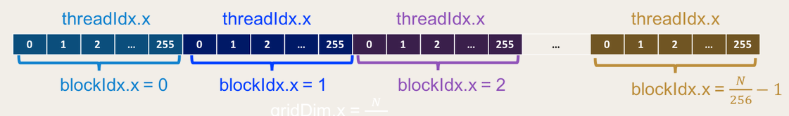

## 1.什么是CUDA？

CUDA，全称为：Compute Unifid Device Architecture，意思是计算统一设备架构。CUDA 是由NVIDIA发布的一种异构编程语言，目的是为了对GPU进行通用性编程开发。异构编程意味着代码能够运行在两个不同的平台上：主机（CPU）和设备（NVDIA GPU 设备）。


## 2.为什么使用GPU？

首先，CPU的性能已经非常强大了，而且适用于并行执行任务较少的低延迟操作。 但是如果我们必须运行需要大量并行处理的代码，那么 CPU 将需要消耗更长的时间来执行并行任务。并且，由于CPU中的线程占据资源较多，而且在操作系统中切换上下文是一个缓慢而繁琐的过程。相比而言，GPU 具有指数级的高计算吞吐量和带宽。所以，GPU 更适合并行数据处理，同时GPU更适合对大量数据进行浮点运算。在未来的编程开发中，并行计算具备巨大潜力，因此使用掌握GPU编程尤为重要。

## 3.前提条件

### 3.1设备装备

- **硬件**----一张NVIDIA图像运算卡
- **CUDA toolkit**----这里可以参考NVIDIA官方的下载链接（https://developer.nvidia.com/cuda-downloads）

### 3.2CUDA编程相关术语

在我们开始正式编程之前，首先需要了解一些**CUDA**编程的相关术语。

- **Host**：Host是指硬件系统的CPU，也就是异构编程的主平台。与主平台相关的系统内存（DRAM），是指CPU访问的内存，称为**Host memory**。
- **Devices**：显而易见，就是指GPU，与之对应的内存叫做**Device memory**。
- **Kernel**：Kernel就是一个函数，在GPU中的一个线程中执行。
- **Kernel launch**：这是一条CPU端的指令，让GPU并行运行代码。
- **Excution Configuration**：运行在GPU端的线程数量，以及定义方式。
- **CUDA cores**：就是NVIDIA图像卡的浮点单元。

### 3.3工作流

Host端（CPU）主要是控制指令的运行，程序被有序的加载到内核中，Host端还要负责内核发布的工作（kernel launch）。

- **host-to-device transfer**：可以使用**cudaMalloc**来分配设备端（GPU）的内存，而将host端的内存数据拷贝到设备端，可以使用**cudaMemcpy**，host端和设备端之间的通信则是通过PCI总线完成的。
- **kernal-load**：加载GPU上的程序并运行，同时缓存片上数据来提高性能。
- **device-to-host transfer**：将设备端内存中的结果拷贝到host端内存中，可以使用**cudaMemcpy**，进而释放设备端内存中数据可以使用**cudaFree**。

当设备端执行内核代码时，host端继续继续加载或执行下一行代码，直到它到达另一个设备端代码或主机代码的结尾。

## 4.代码实例

### 4.1 Hello World

按照编程惯例，让我们首先用CUDA语言写一个Hello world代码。

````c
#include <stdio.h>
#include <cuda.h>


__global__ void hello_world() {
    printf("Hello, World\n");
}

int main() {
    hello_world<<<1,1>>>();
    cudaDeviceSynchronize();
    return 0;
}
````

- **\_\_global\_\_**：表示修饰函数在设备（GPU）上运行并从host端（CPU）调用。 它定义了内核代码。
- **hello_world<<<1,1>>>()**：**<<<M,T>>>**表示内核启动的信号，需要为包含**\_\_global\_\_**的代码调用它。内核以 M 个线程块的网格形式启动，每个线程块有**T**个并行线程。
- **cudaDeviceSynchronize()**：CUDA代码异步启动，host端可能并不总是等待设备完成其执行。**cudaDeviceSyncronize**强制设置host端等待设备完成执行。

接下来，就是使用编译器来编译代码：

```
$ nvcc -o hello helloworld.cu
```

NVIDIA 编译器将设备代码和host代码分开。设备代码：hello_world 使用NVDIA编译器编译，host端的main函数使用 gcc 编译。

该程序打印一个简单的 hello world，这没有显示CUDA的全部功能。因为这里只有一个线程执行hello world。

### 4.2线程的层次结构

在CUDA中，一个线程具有三层结构：

- **Threads**：线程是在其中一个CUDA核心中运行的单个进程，每个内核调用都会创建一个网格。
- **blocks**：块是线程的集合。
- **grids**：网格是块的集合。

### 4.3内置变量

- **threadIdx.x**：我们可以使用内置变量获取当前线程在其块内的索引。
- **blockIdx.x**：我们可以获得网格中当前块的索引。
- **gridDim.x**：我们可以使用内置变量来调整网格的大小。

接下来，让我们进一步使用GPU进行并行编程和浮点运算：

```c
#include <stdio.h>
#include <cuda.h>

#define N  10000000

__global__ void vector_add(float *a, float  *b, float *out, int n) {
    int index = threadIdx.x;
    int stride = blockDim.x
    for(int i=0; i<n; i++) {
        out[i] = a[i] + b[i];
    }
}   

int main() {
    // host端定义内存变量
    float *h_a, *b, *out;
    
    // 设备端定义内存变量
    float *d_a;
    
    // host端分配内存
    h_a   = (float*)malloc(sizeof(float) * N);
    b     = (float*)malloc(sizeof(float) * N);
    out   = (float*)malloc(sizeof(float) * N);
   
   // 初始化 h_a 和 b
    for(int i=0; i<N; i++) {
        h_a[i] = 0.1f;
        b[i]   = 0.2f;
    } 
    
    // 设备端分配内存，然后将数据拷贝到设备端
    cudaMalloc((void**)&d_a, sizeof(float) * N);
    cudaMemcpy(d_a, h_a, sizeof(float) * N, cudaMemcpyHostToDevice);    
    vector_add<<<1,256>>>(h_a, b, out, N);
    
    // 释放设备端内存
    cudaFree(d_a);

    // 释放host端内存
    free(h_a);
    free(b);
    free(out);
    
    // 成功运行
    return 0;
}
```

线程的内核配置（**kernal configuration**）通过**<<<M, N>>>***传递。CUDA以32的幂启动内核数量。这里，线程（**threadIdx**） 的值范围从 1 到 256。块（**blockDim.x**）的值是256。如果我们设置**<<<1,1>>>**那么索引是1，以及stride也将是，那么实施向量加中的代码将是：

```c
for(int i=0; i<0;i++){
   ...
}
```

每个线程以 256 的步幅遍历数组。即对于第一次迭代，线程 0 首先计算数组中的第 0 个元素。在第二次迭代中它将首先计算 256 个元素，在第三次迭代中 256 +256 = 512 个元素。对于迭代 i 和 stride 的每个第 n 个元素，当前正在处理的元素是n + i * stride。


## 5.GPU内部组成

一个GPU主要有两大组成部件：

- **global memory**：它与CPU中的RAM相同，设备端和host端都可以访问它。
- **Streaming Multiprocessor**：进行实际计算的设备。通俗地说，就是 CUDA 核心。

CUDA GPU有多个并行处理器，简称为SMs。每个SM由多个并行处理器组成，可以运行多个并发线程块。 例如，我们已经定义了块大小为256，现在我们需要找出网格的大小，我们将元素数除以块大小。

````c
int BLOCKS_NUM = (N + BLOCK_SIZE — 1) / BLOCK_SIZE;
vector_add<<<BLOCKS_NUM, BLOCK_SIZE>>>(h_a, b, out, N);

````

这时，编写内核代码中，假设我们有足够的网格来覆盖数组中的所有元素，示例如下：

```c
int index = blockIdx.x * blockDim.x + threadIdx.x;
int stride = blockDim.x * gridDim.x;
```



详细的代码可以参考文末的github链接。

## 6.总结

### 6.1优点

- **使用简单**：CUDA API 允许我们使用 GPU，无需对 GPU 有深入的了解。 由于 CUDA 基本上是带有 NADIA 扩展的 C程序。 它可以在C代码库中以最少的代码更改实现。
- **性能突出**：NVDIA 同时实现硬件和 API。 这允许他们对 API 进行微调，以最大限度地发挥 GPU 的性能。

### 6.2不足

- **闭源软件**：NVDIA 是 CUDA 的所有者，拥有封闭的架构。 我们需要 NVDIA 设备和 CUDA sdk 工具才能在系统中运行。
- **只有简单的循环运行**：CUDA 可以实现递归，但实现起来很痛苦，而且很难摆脱。

## 7.链接

https://docs.nvidia.com/cuda/cuda-runtime-api/group__CUDART__MEMORY.html#group__CUDART__MEMORY_1gc263dbe6574220cc776b45438fc351e8

https://developer.nvidia.com/blog/cuda-pro-tip-write-flexible-kernels-grid-stride-loops/

